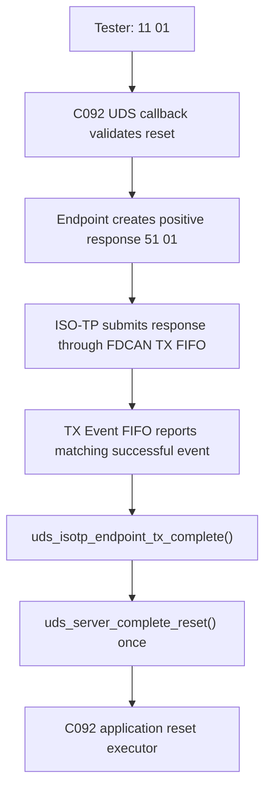

# Issue #13 follow-up — STM32C092 Keil callback/context compile errors

## Scope

This follow-up addresses the two latest reporter comments on [Issue #13][1]: the STM32C092 Keil compile error and the question about `application_callbacks`, `application_context`, `reset_event_callback`, and `reset_event_context`.

The reporter-supplied Keil build log shows four `use of undeclared identifier` errors at the generated `main.c` call to `uds_c092_app_init()`. The copied `uds_app_fdcan.c` itself compiled; the failure is in the application call site. The four names are not functions and are not library globals. They are parameter names in the optional callback-capable initializer.

## Root cause

The reporter’s generated `main.c` called:

```c
uds_c092_app_init(&uds_transport, uds_c092_platform_now_ms(),
                  &application_callbacks, application_context,
                  reset_event_callback, reset_event_context);
```

but the project declared none of those four application-owned objects. The Keil project source list also contains no application callback source/header that could define them. The current C092 adapter correctly consumes these values as explicit parameters and forwards them to `UdsIsoTpEndpointConfig`; it does not define hidden globals.

The API ownership is:

| Symbol | Kind | Owner | Required? |
|---|---|---|---|
| `application_callbacks` | `const UdsCallbacks *` argument | Generated application | No; pass `NULL` when no extra callbacks are needed |
| `application_context` | `void *` argument | Generated application | No; pass `NULL` when callbacks need no context |
| `reset_event_callback` | `UdsIsoTpResetEventFn` argument | Generated application diagnostics | No; pass `NULL` when no timestamped instrumentation is configured |
| `reset_event_context` | `void *` argument | Generated application diagnostics | No; pass `NULL` when the event callback is `NULL` |

The C092 adapter itself always installs its application-owned ECUReset prepare/execute callbacks for the supported `0x11 01` path. Therefore, the reporter does not need to declare an `application_callbacks` object merely to use ECUReset.

## Fix

The maintained C092 application header now includes `uds_app_config.h`, so generated `main.c` receives the profile ID constants used by transport initialization. The maintained C092 adapter also exposes:

```c
void uds_c092_app_init_default(UdsC092FdcanTransport *transport, uint32_t now_ms);
```

This is an explicit copy-ready profile wrapper around the authoritative initializer. It passes `NULL` for all optional application callback/context and reset-event arguments without creating globals or weakening the generic API.

The generated C092 `main.c` should use:

```c
static UdsC092FdcanTransport uds_transport;

uds_c092_fdcan_transport_init(&uds_transport, &hfdcan1,
                              UDS_C092_REQUEST_ID, UDS_C092_RESPONSE_ID);
uds_c092_app_init_default(&uds_transport, uds_c092_platform_now_ms());
```

The equivalent explicit form is:

```c
uds_c092_app_init(&uds_transport, uds_c092_platform_now_ms(),
                  NULL, NULL, NULL, NULL);
```

If the application has its own UDS callbacks or reset-event diagnostics, it must declare those objects in application-owned code and pass them explicitly. The adapter does not invent or hide them.

The guide also now shows the required FDCAN startup notification:

```c
if (HAL_FDCAN_ActivateNotification(
        &hfdcan1,
        FDCAN_IT_RX_FIFO0_NEW_MESSAGE | FDCAN_IT_TX_EVT_FIFO_NEW_DATA,
        0U) != HAL_OK) {
    Error_Handler();
}
```

The TX event callback remains required for the C092 ECUReset completion contract:

```c
void HAL_FDCAN_TxEventFifoCallback(FDCAN_HandleTypeDef *hfdcan, uint32_t flags) {
    if (hfdcan == &hfdcan1)
        uds_c092_fdcan_on_tx_event(&uds_transport, flags);
}
```

## ECUReset flow

The callback/context correction does not change the established ECUReset architecture:



`HAL_FDCAN_AddMessageToTxFifoQ() == HAL_OK` remains enqueue acceptance, not physical completion. The C092 TX Event FIFO and message-marker correlation were not removed or bypassed. No `HAL_Delay()`, busy loop, or generic-library HAL dependency was introduced.

## Exact files changed

| File | Change |
|---|---|
| `examples/stm32c092/uds_app_fdcan.h` | Includes the C092 profile constants, documents optional parameters, and declares the copy-ready `uds_c092_app_init_default()` wrapper. |
| `examples/stm32c092/uds_app_fdcan.c` | Implements the explicit NULL-parameter wrapper over the callback-capable initializer. |
| `examples/stm32c092/README.md` | Replaces the undefined-symbol example with default/explicit-NULL wiring and documents TX Event FIFO notification. |
| `tests/conformance/check_validation_assets.py` | Requires the default initializer and explicit NULL example while preserving C092 TX-event and generic endpoint checks. |
| `docs/conformance/issue13_c092_keil_followup_report.md` | Records the root cause, ownership model, fix, data flow, and validation boundary. |

No files from the reporter archive were committed, and no vendor HAL/CMSIS code was copied into the repository.

## Validation

| Gate | Result |
|---|---|
| Host GCC build and CTest | PASS, 6/6 |
| ASan/UBSan CTest | PASS, 6/6 |
| Issue #13 static validation assets | PASS |
| C092 adapter syntax check against reporter-supplied HAL headers | PASS |
| Patched reporter `main.c` syntax check with `uds_c092_app_init_default()` | PASS with ARM GCC; the original four undeclared identifiers are gone |
| Strict ARM GCC portability | PASS at `ISOTP_MAX_PAYLOAD=4095` |
| STM32F767 cross-build | PASS |
| clang-format, clang-tidy, cppcheck | PASS |
| Keil ArmClang compile/link | Not executable in the available Linux environment; ArmClang/µVision was not installed |
| C092 firmware ELF/HEX/BIN generation | Not executed; no Keil/linker toolchain was available |
| Physical C092 ECUReset HIL | Not executed |

The source/API mismatch is corrected and statically validated. A temporary copy of the reporter project was patched to replace the four-identifier call with `uds_c092_app_init_default()`; its generated `main.c` and maintained C092 adapter sources passed ARM GCC syntax validation. The reporter must apply that one-line change in the local generated `main.c`. A real Keil rebuild is still required to verify the complete project compile, link, and firmware generation.

Issue #13 remains open for reporter confirmation and physical C092 validation. Host CI success alone is not treated as proof of a Keil build or physical ECUReset response ordering.

## References

[1]: https://github.com/mahdi-benhassen/stm32_uds_iso_tp/issues/13 "Issue #13 — STM32C092 transport and Keil integration"
[2]: https://github.com/mahdi-benhassen/stm32_uds_iso_tp/issues/13#issuecomment-5418638722 "Reporter comment: STM32C092 Keil compile error"
[3]: https://github.com/mahdi-benhassen/stm32_uds_iso_tp/issues/13#issuecomment-5418652230 "Reporter comment: callback/context symbols"
