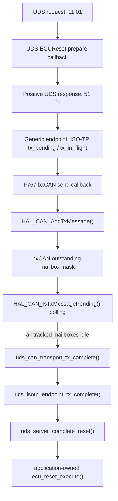

# GitHub Issue #13 — `tx_pending` coupling audit and fix

## Summary

The reporter’s latest comment says that the bxCAN transport’s `tx_pending` boolean is unrelated to ECUReset (`0x11`) and should be removed. The audit confirmed that there are two different concepts with similar names:

1. `library/src/endpoint.c` owns protocol-level `tx_pending` and `tx_in_flight`. These are required by the generic ISO-TP/UDS endpoint to sequence frames, queue responses, and associate the final ECUReset response with exactly-once reset completion.
2. The STM32F767 bxCAN application transport had a separate `UdsCanTransport.tx_pending` boolean. It was used only to reject another send and to gate mailbox polling, duplicating endpoint sequencing without being an ECUReset contract. It has been removed.
3. The STM32C092 FDCAN adapter retains hardware-specific `tx_pending` state because it must correlate an in-flight submission with a matching TX Event FIFO entry. Removing that state would regress the Issue #12 completion guarantee. It is not used as a generic or bxCAN ECUReset flag.

The fix is therefore deliberately narrow: **remove transport-level `tx_pending` from the F767 bxCAN path, retain protocol-owned endpoint state, and retain the C092 FDCAN event-correlation state.** No new generic TX state machine was introduced.

## Complete `tx_pending` audit

| Location | Declared/initialized | Set/cleared | Checked | Architectural purpose |
|---|---|---|---|---|
| `library/include/uds_iso_tp/endpoint.h`, `library/src/endpoint.c` | `UdsIsoTpEndpoint.tx_pending`; initialized false by `uds_isotp_endpoint_init()` | Set when `start_response()` or `isotp_tx_next()` creates a pending ISO-TP frame; cleared only after `send_frame()` accepts it | Checked by `start_response()` and `uds_isotp_endpoint_process()` | Required protocol-level sequencing and response queueing. It remains generic and hardware-independent. |
| `examples/stm32c092/can_transport_fdcan.h/.c` | Transport `tx_pending`; initialized false by `uds_c092_fdcan_init()` | Set after `HAL_FDCAN_AddMessageToTxFifoQ()` accepts a submission; cleared by the matching TX Event FIFO callback or terminal loss/abort/error handling | Checked by the C092 completion callback and TX-event handling | Required hardware correlation for FDCAN TX Event FIFO completion. It is not a generic endpoint state and is not removed. |
| `App/Inc/can_transport.h`, `App/Src/can_transport.c` | **Removed** from `UdsCanTransport` | No remaining set/clear operations | No remaining checks | It was a duplicate bxCAN busy gate, not a physical completion proof and not an ECUReset flag. |

The remaining generic endpoint `tx_pending` references are intentional. The Issue #13 change removes the F767 transport references without removing or renaming the endpoint’s protocol state or the C092 hardware-event state.

## Data-flow diagram

For C092, the transport branch differs only at the hardware boundary: FDCAN TX FIFO submission enables stored TX events, rotates a message marker per submission, and waits for a matching successful `FDCAN_TX_EVENT` before returning completion to the endpoint. The C092-specific `tx_pending` is therefore justified by a real hardware correlation requirement.

## Why the reporter considers bxCAN `tx_pending` unrelated to ECUReset

The old F767 boolean attempted to answer two separate questions with one transport flag: whether the adapter should accept another frame and whether the previously accepted frame had completed. ECUReset needs the endpoint’s established completion contract, not a transport busy flag. The endpoint already knows whether a response is pending, whether a frame is in flight, whether it is the final response frame, and whether that final frame carries reset completion metadata.

The old bxCAN guard also prevented a second call to `HAL_CAN_AddTxMessage()` while the boolean was set, even though ISO-TP itself already controls when a frame is submitted. Conversely, treating `HAL_CAN_AddTxMessage() == HAL_OK` as completion would be incorrect: it means that the controller accepted the frame into a mailbox, not that the frame has appeared on the physical bus.

The corrected bxCAN adapter therefore has a thin responsibility: validate the outgoing frame, build the HAL header, submit it, and retain only an outstanding-mailbox bitmask needed by its completion polling callback. The mask is ORed for each accepted mailbox and cleared only when `HAL_CAN_IsTxMessagePending()` reports no tracked mailbox remains pending. There is no artificial delay and no transport boolean coupled to ECUReset.

## Exact ECUReset behavior after the fix

For a physical `11 01` request, UDS validates and authorizes the reset, and the endpoint generates the positive payload `51 01`. ISO-TP owns the pending/in-flight response sequence. The F767 adapter submits the resulting Classical CAN frame through `HAL_CAN_AddTxMessage()` and reports mailbox-idle completion through its existing callback. The application calls `uds_isotp_endpoint_tx_complete()` only through the established application completion path; the endpoint then calls `uds_server_complete_reset()` exactly once and invokes the application-owned `ecu_reset_execute()` callback.

The C092 path is unchanged in principle but uses the controller-specific TX Event FIFO mechanism: enqueue acceptance is not completion, matching successful `FDCAN_TX_EVENT` is completion, and TX-event FIFO loss or abort is terminal for the in-flight transfer. The Issue #12 C092 completion handling was not removed or weakened.

## Exact files changed

| File | Change |
|---|---|
| `App/Inc/can_transport.h` | Removed `UdsCanTransport.tx_pending`; documented the remaining outstanding-mailbox mask. |
| `App/Src/can_transport.c` | Removed the duplicate send gate and boolean state; retained HAL enqueue validation and cumulative mailbox completion polling. |
| `examples/stm32f767_bxcan/README.md` | Documents the thin bxCAN boundary, mailbox-mask completion, and ECUReset independence. |
| `library/tests/uds/test_adapters.c` | Adds bxCAN send success/failure, multiframe/flow-control, `51 01`, exactly-once reset, and existing FDCAN regression assertions. |
| `tests/conformance/check_validation_assets.py` | Adds static architecture checks rejecting bxCAN `tx_pending`, artificial delays, and accidental removal of generic/C092 completion state. |
| `docs/conformance/issue13_tx_pending_report.md` | This audit, data-flow diagram, decision record, and validation report. |

No generic library source was given an STM32 HAL dependency. No `HAL_Delay()` or new generic TX state machine was introduced.

## Tests and validation

| Validation | Result |
|---|---|
| Normal host CMake/Ninja build | PASS |
| Normal CTest | PASS, 6/6 |
| ASan/UBSan CTest | PASS, 6/6 |
| F767 bxCAN adapter contract | PASS: successful send, send failure/retry, multiframe FF/CF progression, `51 01`, exactly-once reset |
| FDCAN adapter contract | PASS: existing host FDCAN path remains covered |
| Static Issue #13 architecture gate | PASS: bxCAN has no `tx_pending`; generic endpoint and C092 event state remain present |
| Strict Cortex-M0+ ARM GCC portability | PASS at `ISOTP_MAX_PAYLOAD=4095` |
| STM32F767 Release cross-build | PASS: 13,964 B Flash and 43,312 B RAM |
| Generic-library coverage | PASS, 67% total; `isotp.c` 88%, `uds.c` 79%, `endpoint.c` 89% |
| clang-format | PASS |
| clang-tidy | PASS |
| cppcheck | PASS; informational configuration-count note only |
| C092 syntax check against supplied reporter project | PASS |
| C092 physical HIL capture | **Not executed**; no board, analyzer, or debug probe was available |

The C092 dry-run plan remains available, but a dry run and a syntax check cannot prove physical `51 01`-before-reset ordering. No hardware completion claim is made.

## Acceptance status

The software and architecture acceptance criteria are satisfied: every `tx_pending` use was audited; the unnecessary F767 transport boolean was removed; ISO-TP remains responsible for protocol sequencing; bxCAN remains thin; ECUReset remains independent of the removed flag; `51 01` and exactly-once reset execution remain covered; C092 FDCAN TX Event FIFO completion remains intact; the generic library remains hardware-independent; and no arbitrary delay was introduced.

The remaining limitation is physical HIL. Issue #13 should not be marked hardware-validated until a real STM32F767 bxCAN capture and a real STM32C092 FDCAN capture demonstrate the expected response and completion behavior on the bus.

## References

[1]: https://github.com/mahdi-benhassen/stm32_uds_iso_tp/issues/13 "Issue #13 — tx_pending and ECUReset transport coupling"
[2]: https://github.com/mahdi-benhassen/stm32_uds_iso_tp/issues/12 "Issue #12 — UDS ECUReset response ordering"
[3]: https://www.st.com/resource/en/reference_manual/rm0440-stm32g4-series-advanced-armbased-32bit-mcus-stmicroelectronics.pdf "STM32 FDCAN reference material"
