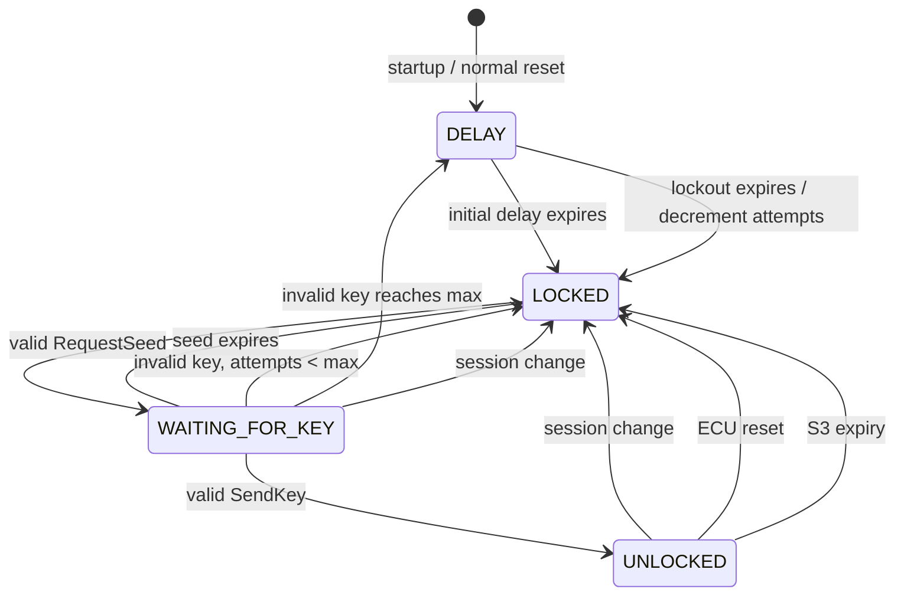

# Issues #7 and #8 implementation report

## Executive summary

Issues #7 and #8 identified gaps in the previous UDS dispatcher: Session Control (`0x10`) accepted every recognized session by direct assignment, and Security Access (`0x27`) delegated every key decision to callbacks without owning request sequencing, initial delay, failed-attempt lockout, seed lifetime, or session interaction.

The current implementation adds explicit, hardware-independent state machines inside the existing UDS core. Session transitions are centralized in `uds_session_transition_allowed()`. Security state is explicit in `UdsServer`, with `LOCKED`, `WAITING_FOR_KEY`, `UNLOCKED`, and `DELAY` states. Timing uses injected monotonic `uint32_t` values and wrap-safe subtraction. The implementation remains heap-free, non-blocking, bounded, and independent of STM32 HAL/CMSIS.

**Software validation status: complete for the written Issue #7/#8 requirements and the available screenshot evidence.** Physical CAN/FDCAN HIL, production cryptography, and formal ISO certification remain outside the evidence produced by this repository run.

## 1. Issue #7 root cause and fix

The previous Session Control handler stripped the suppress bit, accepted only three session values, assigned `server->session = subfunction`, reset security, and returned a positive response. It did not represent Safety System Diagnostic Session, did not validate transitions, did not distinguish forbidden transitions from unsupported values, and did not connect reset/S3 events to a complete session policy.

The replacement introduces an explicit four-session policy and a controlled transition API. It preserves the existing UDS callback and endpoint architecture instead of adding a second session subsystem.

### Session state diagram

```mermaid
stateDiagram-v2
    [*] --> Default
    Default --> Extended: 10 03
    Extended --> Programming: 10 02
    Extended --> Default: 10 01 / reset pending
    Programming --> Default: 10 01 / reset pending
    Safety --> Default: 10 01 / reset pending
    Default --> Default: 10 01
    Extended --> Extended: 10 03
    Programming --> Programming: 10 02 / programming reset pending
    Safety --> Safety: 10 04
    Extended --> Default: S3 expiry
    Programming --> Default: S3 expiry
    Safety --> Default: S3 expiry
    Default --> Default: ECU reset
    Extended --> Default: ECU reset
    Programming --> Default: ECU reset
    Safety --> Default: ECU reset
```

The Issue #7 detailed screenshot explicitly shows Default, Extended Diagnostic, and Programming nodes with `10 03`, `10 02`, `10 01`, and `11 xx` paths. The overview screenshot also lists Safety System Diagnostic Session (`0x04`) but does not show a complete Safety transition graph. The implementation therefore allows Safety to return to Default and rejects undocumented transitions into or out of Safety rather than inventing them.

### Session transition matrix

| Current | Default `0x01` | Programming `0x02` | Extended `0x03` | Safety `0x04` |
|---|---:|---:|---:|---:|
| Default | Allowed | Denied | Allowed | Denied |
| Programming | Allowed | Same-session request allowed | Denied | Denied |
| Extended | Allowed | Allowed | Same-session request allowed | Denied |
| Safety | Allowed | Denied | Denied | Same-session request allowed |

A forbidden but recognized transition returns NRC `0x22` (`ConditionsNotCorrect`). An unsupported session value returns NRC `0x12` (`SubFunctionNotSupported`). An invalid request length returns NRC `0x13` (`IncorrectMessageLengthOrInvalidFormat`).

### Session request and response

The request must be exactly `10 <subfunction>`. The `0x80` suppress-positive-response bit is removed before policy lookup, so `0x81` through `0x84` select the four corresponding sessions rather than new session values. A successful non-suppressed response is:

```text
50 <session> <P2 ms high> <P2 ms low> <P2* / 10 ms high> <P2* / 10 ms low>
```

The existing defaults remain P2 `50 ms` and P2* `5000 ms`; no timing values were copied from the screenshots. A suppressed successful request returns `UDS_RESULT_NO_RESPONSE` and does not emit a positive response.

### Session side effects

Every accepted session change invalidates the current security level and seed and stops an active download context. A non-default-to-default request marks a normal reset pending. A request for Programming marks a programming reset pending. The application owns the physical reset and must call `uds_server_apply_reset()` with either `UDS_RESET_NORMAL` or `UDS_RESET_PROGRAMMING` after that reset occurs.

## 2. Issue #8 root cause and fix

The previous Security Access handler treated every odd subfunction as RequestSeed and every even subfunction as SendKey, computed the level arithmetically, and delegated the decision to callbacks. It had no integrated seed-valid state, initial delay, maximum-attempt policy, lockout state, decrement-after-timeout behavior, session policy, or stale-seed rejection. The existing deterministic security-provider helper had a lockout mechanism but was not called by the UDS dispatcher and reset the attempt counter at the maximum, contrary to the Issue #8 diagram.

The current UDS server owns the protocol state machine and delegates only seed generation and key verification to application callbacks. This separates protocol policy from the application’s security algorithm.

### Security state diagram



### Security-level mapping

The screenshots show `27h 02h` for the first unlocked path and `27h 0Ah` for a second path labeled “Unlocked (Level 2).” Under the standard odd/even Security Access pairing, the latter is the Level 5 pair `0x09/0x0A`. The implementation preserves the screenshot’s wire values and documents this label interpretation explicitly.

| Internal level | RequestSeed | SendKey | Sessions |
|---|---:|---:|---|
| Level 1 | `0x01` | `0x02` | Extended and Programming |
| Level 5 | `0x09` | `0x0A` | Extended and Programming |

Other Security Access subfunctions return NRC `0x12`. Default and Safety sessions return NRC `0x7F` (`ServiceNotSupportedInActiveSession`).

### Security flow and NRC matrix

| Condition | Response/NRC | Counter effect | State effect |
|---|---|---|---|
| Valid RequestSeed after delay | `67 <odd> <seed>` | None | `WAITING_FOR_KEY` |
| RequestSeed during initial delay or lockout | NRC `0x37` | None | Remains `DELAY` |
| SendKey without valid seed | NRC `0x24` | None | Remains `LOCKED` |
| SendKey for another level | NRC `0x24` | None | Remains `LOCKED` |
| Invalid key below maximum | NRC `0x35` | Increment | `LOCKED` |
| Invalid key reaching maximum | NRC `0x36` | Remains at maximum until expiry | `DELAY` |
| Any request during lockout | NRC `0x37` for valid RequestSeed | None | `DELAY` |
| Lockout expiry | No response by tick | Decrement by one | `LOCKED` |
| Valid key | `67 <even>` | Reset to zero | `UNLOCKED` |
| Seed expiry | No response by tick | None | `LOCKED` |
| Callback denial other than invalid key | Mapped callback NRC | No increment | Seed remains valid unless policy says otherwise |

Only `UDS_RESULT_INVALID_KEY` is counted as a failed attempt. This prevents malformed input, unsupported levels, and unrelated application denials from consuming the attempt budget.

### Timing and reset behavior

The default initial security delay is `10000 ms`, the default lockout is `10000 ms`, the default seed lifetime is `10000 ms`, and the default maximum attempt count is `3`. All values can be configured with `uds_server_set_timing()`.

Startup and normal reset clear the attempt counter, invalidate the seed, lock security, return to Default Session, and start the initial delay. Programming reset performs the same logical reset but skips the initial delay so reprogramming is not delayed unnecessarily. At lockout expiry, the counter decreases by one; it is not reset to zero. A successful unlock resets it to zero.

All deadline checks use monotonic unsigned arithmetic. S3 and security expiry decisions are based on expressions equivalent to:

```c
(uint32_t)(now_ms - start_ms) >= timeout_ms
```

and:

```c
(int32_t)(now_ms - deadline_ms) >= 0
```

No blocking delay, `HAL_Delay()`, `sleep()`, busy loop, or platform register is used in the library.

## 3. Files changed and rationale

| File | Reason |
|---|---|
| `library/include/uds_iso_tp/uds.h` | Adds four-session constants, explicit odd/even SecurityAccess mapping, session/security/address metadata, addressed dispatch, deferred reset state, timing defaults, and policy/reset APIs |
| `library/src/uds.c` | Implements centralized transition policy, service metadata checks, addressing checks, initial delay, seed lifetime, failed-attempt lockout, NRC handling, wrap-safe S3 timing, and deferred reset completion |
| `library/include/uds_iso_tp/isotp.h` | Adds configurable frame padding, optional full-duplex mode, and event metadata while preserving independent RX/TX contexts |
| `library/src/isotp.c` | Serializes padding at the frame boundary and applies optional full-duplex unexpected-N_PDU behavior without altering logical payload lengths |
| `library/include/uds_iso_tp/endpoint.h` | Adds functional request ID, bounded control/response queue state, optional TX-completion callback, and deferred reset completion API |
| `library/src/endpoint.c` | Composes independent RX/TX paths, classifies physical/functional IDs, queues simultaneous traffic, and invokes reset execution only after response completion |
| `tests/security/uds_security_reference.h` | Defines the explicitly non-production reference/test algorithm, key-calculation and callback APIs, and provider state declarations |
| `tests/security/uds_security_reference.c` | Implements deterministic seed generation, bytewise test-key calculation, callback adapters, and direct-provider timing tests |
| `tools/security_test_key.c` | Provides the dependency-free host manual calculator for displayed four-byte seeds |
| `App/Src/uds_app.c` | Wires physical/functional IDs, mailbox completion, and application-owned ECUReset callbacks into the F767 example |
| `App/Src/can_transport.c` | Tracks bxCAN TX mailbox completion without blocking or delaying the generic layer |
| `App/Src/uds_platform.c` | Owns the target-specific `NVIC_SystemReset()` executor |
| `library/tests/uds/test_uds.c` | Covers explicit SecurityAccess mapping, service metadata, functional-address policy, and existing UDS service flows |
| `library/tests/uds/test_endpoint.c` | Covers endpoint full-duplex overlap, bounded control/response queueing, deferred ECUReset completion, invalid reset type, and suppressed response |
| `library/tests/uds/test_session_security.c` | Adds deterministic unit coverage for Issues #7/#8, reference vectors, callback integration, and the test-layer provider without hardware or real sleeps |
| `library/CMakeLists.txt` | Keeps the generic library and portability object provider-free; registers the session/security contract and reference utility tests in CTest |
| `docs/uds/session_control.md` | Documents Session Control policy and API |
| `docs/uds/security_access.md` | Documents Security Access state machine, callback boundary, and reference/test separation |
| `docs/uds/security_reference.md` | Specifies the repository-generated test algorithm, vectors, manual flow, and production replacement requirements |
| `docs/uds/README.md` | Links the UDS policy and reference documents |
| `docs/standalone/validation.md` | Records the reference utility/vector test and software-versus-HIL evidence boundary |
| `.github/workflows/standalone-uds.yml` | Uses the stable gcovr function merge mode and runs the expanded test/reference gates |

No ISO-TP source was changed for Issues #7/#8. No STM32-specific code entered `library/`; the application reset callback remains outside the core.

## 4. Test coverage

The dedicated `uds_iso_tp_session_security_contract` suite uses a deterministic clock and covers the following requirements:

| Requirement group | Coverage |
|---|---|
| Session startup | Default Session at initialization |
| Transition policy | All allowed and forbidden matrix entries, same-session requests, Safety conservative policy |
| Session format | Unsupported value, truncated request, suppress-positive-response bit |
| Session response | Positive response `0x50` with P2/P2* values |
| Programming path | Programming transition and programming-reset pending behavior |
| Reset | Normal reset and programming reset return to Default and clear security state |
| S3 | Timeout before boundary, exact boundary expiration, and Tester Present refresh |
| Security initial delay | RequestSeed at `9999 ms` rejected and at `10000 ms` accepted |
| Request sequencing | SendKey without seed, wrong level, stale seed, expired seed |
| Failed attempts | Invalid key one, two, and three; NRC `0x35` and `0x36` |
| Lockout | NRC `0x37` during delay and exact 10-second expiration |
| Counter policy | Counter decrements from three to two after lockout; success resets to zero |
| Seed lifecycle | Seed issue, replacement, expiry, invalidation after success/session/reset |
| Security levels | Level 1 `0x01/0x02` and Level 5 `0x09/0x0A` |
| Callback policy | Non-invalid-key denial does not increment the failed counter |
| Malformed input | Zero/truncated `0x27`, invalid subfunction, short key, extra seed data |

## 5. Validation results

The final local validation run passed:

| Gate | Result |
|---|---|
| Architecture check | PASS; 180 tracked paths |
| Validation-asset check | PASS; 13 conformance vectors and 18 physical cases |
| Normal CMake/Ninja build | PASS |
| Normal CTest | PASS; 6/6 suites with adapter examples enabled; 5/5 core suites with examples disabled |
| ASan/UBSan build and CTest | PASS; 5/5 core suites |
| Strict C99 host portability build | PASS |
| Cortex-M0+ ARM GCC freestanding compile | PASS with `ISOTP_MAX_PAYLOAD=4095` |
| Coverage | PASS; 67% total generic-library source coverage, with 88% `isotp.c`, 79% `uds.c`, and 87% `endpoint.c` in the current run |
| clang-format | PASS |
| clang-tidy | PASS |
| cppcheck | PASS; standard informational too-many-configurations note only |
| STM32F767 cross-build | PASS; 26,784 B Flash and 43,304 B RAM in the current run |
| Classical CAN HIL runner | Dry-run only; 15 cases |
| CAN-FD HIL runner | Dry-run only; 18 cases |
| Physical STM32C092/STM32F767 HIL | Not executed; hardware and analyzer unavailable |

The hosted workflow should run the same expanded CTest and portability gates after publication. The existing F767 target remains bxCAN/Classical CAN; the FDCAN contract remains hardware-independent.

## 6. Memory and embedded-safety impact

The change adds state fields to `UdsServer` and bounded endpoint queue storage but does not add heap allocation, recursion, or unbounded loops. Payload-sized transport buffers remain governed by the existing `ISOTP_MAX_PAYLOAD` configuration.
 The C092-compatible build continues to use `ISOTP_MAX_PAYLOAD=4095`. The existing C092 memory finding remains valid: the application must choose a payload bound based on its complete map file and stack margin. The new timing/state fields are small compared with the transport buffers.

The default 16,384-byte payload bound is not increased. The application-owned reset and security callbacks remain deterministic seams; no cryptographic algorithm is claimed as production-safe.

## 7. Remaining limitations and issue readiness

The implementation satisfies the written Issue #7/#8 software requirements and the available screenshot-specific requirements. The deterministic test/reference layer is covered by direct vectors, callback tests, and the integrated server, with the following explicit interpretation decisions:

1. Safety Session (`0x04`) is supported as an explicit state but undocumented transitions into or out of it are denied because the detailed screenshot does not show a Safety transition graph.
2. Screenshot label “Unlocked (Level 2)” for `0x0A` is interpreted as the standard odd/even Level 5 pair `0x09/0x0A`; the wire subfunctions are preserved.
3. The issue evidence does not specify a cryptographic algorithm, seed/key width, or byte order. Those remain application callback/provider responsibilities. The repository-generated deterministic reference algorithm is test infrastructure only and is not a production security implementation; its exact formula and vectors are documented separately.
4. A Programming Session request marks a programming reset pending; the application must perform the physical reset and call `uds_server_apply_reset(..., UDS_RESET_PROGRAMMING, ...)` to apply the no-initial-delay reset policy.
5. The repository has not executed a physical STM32C092 or STM32F767 diagnostic campaign, so electrical interoperability, analyzer timing, interrupt latency, watchdog behavior, and board transceiver configuration remain unverified.

**Issue #7 readiness:** ready for software review/closure based on the documented state-machine policy and deterministic tests; physical HIL remains a separate target-validation requirement.

**Issue #8 readiness:** ready for software review/closure based on the explicit protocol state machine, deterministic timing tests, NRC matrix, and callback security boundary; production cryptographic approval and physical HIL remain outstanding.

**Follow-on issue readiness:** Issues #9–#12 have deterministic host coverage and target-build validation for the implemented software boundaries. Physical CAN/FDCAN behavior, application-specific service matrices, and target reset/completion measurements remain open validation work.

This report does not claim formal ISO 14229 certification, production security, bootloader safety, or complete physical interoperability.

## 8. Follow-on issues #9–#12

The follow-on implementation preserves the existing layered architecture rather than creating a second transport or UDS stack.

| Issue | Implementation | Host coverage | Boundary/limitation |
|---|---|---|---|
| #9 Full duplex | `IsoTpRx` and `IsoTpTx` remain independent; optional `full_duplex` mode handles same-N_AI SF/FF restart and ignores FC/unknown N_PDUs when no opposite-direction transfer is active. The endpoint adds separate bounded control and response pending storage. | Direct unexpected-N_PDU tests and endpoint overlap test cover inbound segmented traffic during outbound segmented response. | The endpoint has one bounded queued UDS response and one control slot; callers must drain it with regular `process()` calls. Table 23 behavior is software-tested, not physically proven. |
| #10 Padding | `padding_enabled`, `padding_value`, and `isotp_config_set_padding()` apply fill bytes at frame serialization. Classic CAN uses DLC 8 when enabled; logical length remains N_PCI-derived. | SF, exact seven-byte SF, FF, FC, final CF, disabled/custom padding, CAN-FD fill, and receive-length tests. | The application transport must preserve emitted DLC/data bytes when handing frames to hardware. |
| #11 Service attributes | `UdsServiceAttribute` centralizes session, allowed-security-level, and address-mode metadata. `address_mode=0` means both; endpoint classifies `request_id` as physical and optional `functional_request_id` as functional. Odd/even SecurityAccess levels 1–5 are explicitly mapped by one public function. | Metadata, mapping, functional read dispatch, physical-only rejection, session restrictions, and protected-attribute tests. | The table is a repository baseline; an ECU-specific policy may replace/extend it. Functional negative-response policy is represented by existing NRC `0x7F` in this implementation. |
| #12 ECUReset | `ecu_reset` authorizes; the positive response is queued first; optional asynchronous `tx_complete` and `uds_isotp_endpoint_tx_complete()` define final-frame completion; `ecu_reset_execute` is application-owned. | Response-before-reset, delayed completion, invalid type, suppressed response, and missing-executor behavior. | No fixed delay can prove physical CAN completion. The target application must define the send/completion semantics and own the actual reset primitive. |

The attached issue screenshots/documents were used only to confirm the requirements: Table 23’s full-duplex distinctions, Table 34’s DLC-8/`0xCC` padding, SID attribute columns, and the ECUReset response-before-reset complaint. They do not define a production SecurityAccess algorithm; the repository continues to use only the explicitly labeled test/reference algorithm.

## References

[1]: https://github.com/mahdi-benhassen/stm32_uds_iso_tp/issues/7 "Issue #7 — Session Handling 0x10"
[2]: https://github.com/mahdi-benhassen/stm32_uds_iso_tp/issues/8 "Issue #8 — Security Access 0x27"
[3]: https://www.iso.org/standard/72439.html "ISO 14229-1:2020 metadata and scope"
[4]: https://github.com/mahdi-benhassen/stm32_uds_iso_tp/blob/main/library/include/uds_iso_tp/uds.h "UDS public API"
[5]: https://github.com/mahdi-benhassen/stm32_uds_iso_tp/blob/main/library/src/uds.c "UDS implementation"
