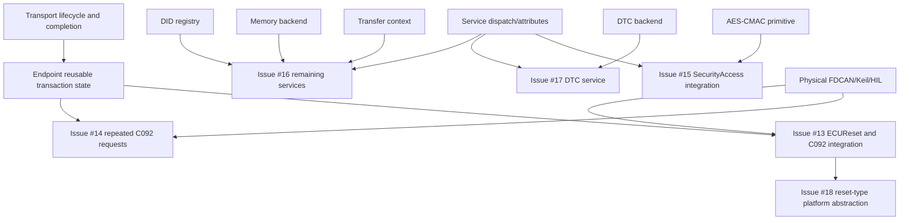

# Open Issues #13–#18 Architecture Audit

## Audit scope and baseline

This audit was completed before modifying the repository for the current open-issue campaign. The baseline is `main` at commit `eca691f`, tagged `v1.2.1`. Issues #13, #14, #15, #16, #17, and #18 are open. Issues #13 and #14 describe the same family of STM32C092 symptoms: the first UDS request after power-on succeeds, while later requests do not receive a response. Issue #13 also contains the earlier bxCAN/ECUReset and C092 callback-integration discussion.

The reporter’s latest Issue #14 project archive contains a successful Keil/Arm Compiler 6 build artifact (`0 Error(s), 0 Warning(s)`), but its generated `main.c` enables only `FDCAN_IT_RX_FIFO0_NEW_MESSAGE`, sets a sample TX header to `FDCAN_NO_TX_EVENTS`, does not install `HAL_FDCAN_TxEventFifoCallback()`, and calls the maintained default C092 initializer without a TX-event notification path. Its FDCAN adapter consequently has no event that can clear the in-flight `tx_pending` state after the first response. The generic library and the C092 adapter both compile; the reported failure is a runtime integration/state-recovery failure.

The earlier Issue #13 compile-error archive has a different failure: its `main.c` passes four undeclared optional names to the callback-capable C092 initializer. The maintained adapter now provides `uds_c092_app_init_default()` and an explicit all-`NULL` form for that case. These two archives must not be conflated.

## Current architecture

The generic implementation is under `library/` and is hardware-independent. `library/src/isotp.c` owns ISO-TP frame serialization, RX reassembly, TX flow control, timeout handling, and reset-to-idle behavior. `library/src/uds.c` owns UDS session/security state, service attributes, service dispatch, UDS response generation, download/transfer callbacks, and the pending ECUReset contract. `library/src/uds_did.c` owns the current small DID registry. `library/src/uds_download.c` owns the bounded download backend and transfer state.

`library/src/endpoint.c` composes ISO-TP and UDS. It receives a complete UDS request, dispatches it, queues control or response frames, submits frames through transport callbacks, waits for the transport completion callback where configured, and invokes `uds_server_complete_reset()` after a final positive ECUReset response. The endpoint’s `tx_pending` and `tx_in_flight` are protocol-owned state and are not the same as a controller adapter busy flag.

The STM32F767 application under `App/` is a bxCAN adapter. The current post-Issue-#13 design retains only a cumulative outstanding-mailbox mask for hardware completion polling; the redundant bxCAN transport `tx_pending` boolean is removed. ECUReset does not depend on this transport mask.

The maintained STM32C092 example under `examples/stm32c092/` is an FDCAN Classic CAN adapter. It submits frames through the FDCAN TX FIFO with `FDCAN_STORE_TX_EVENTS`, rotates a message marker per submission, and clears its hardware-specific in-flight state only after a matching successful TX Event FIFO record or a terminal error. The C092 mainline handoff is deferred out of the ISR. This state is necessary for the C092 completion contract and must not be removed as part of the bxCAN cleanup.

## Current service frontier

The UDS service table currently exposes these implemented service families: `0x10`, `0x11`, `0x19`, `0x22`, `0x27`, `0x28`, `0x2F`, `0x31`, `0x34`, `0x36`, `0x37`, `0x3E`, and `0x85`. Several are callback-driven rather than complete protocol subsystems.

| Area | Current implementation | Gap relevant to open issue |
|---|---|---|
| Session Control `0x10` | Generic session transitions, S3 timeout, programming/default reset metadata | Repeated C092 requests depend on endpoint/transport lifecycle; no dedicated 1000-request C092 regression exists. |
| ECUReset `0x11` | Generic positive-response/deferred-completion path; C092 application accepts only `0x01` | Issue #18 requires five reset types and platform capability results. |
| SecurityAccess `0x27` | Generic application seed/key callbacks, lockout and seed timers | Issue #15 requests an optional AES-CMAC-128 primitive, not a hard-coded production secret. |
| ReadDTCInformation `0x19` | Single raw `read_dtc` callback | Issue #17 requests capability-driven parsing and many subfunctions. |
| DID `0x22` | Static registry with read/write hooks and simple permissions | Issue #16 requests scaling metadata, dynamic DIDs, and coherent `0x2E`/`0x24`/`0x2C` integration. |
| Download/transfer `0x34/0x36/0x37` | Bounded download backend and transfer callbacks | Issue #16 requests upload and file-transfer reuse. |
| Other requested services | Not in service table: `0x14`, `0x23`, `0x24`, `0x29`, `0x2A`, `0x2C`, `0x2E`, `0x35`, `0x38`, `0x83`, `0x84`, `0x86`, `0x87` | Need separate bounded abstractions, explicit unsupported/capability responses, and tests. |

## Dependency graph

The implementation order is therefore transport/endpoint recovery first, then ECUReset platform capability, then cryptographic and DTC abstractions, followed by service groups. A service implementation cannot be called production-ready if its backend or hardware integration is absent.

## Issue-by-issue root-cause hypotheses and affected files

### Issue #13 — C092 integration and ECUReset/bxCAN coupling

The original bxCAN boolean was an unnecessary transport duplicate and was removed in `App/Inc/can_transport.h` and `App/Src/can_transport.c`. The maintained C092 API originally required optional callback/context arguments but the reporter’s generated main supplied undeclared names. The current C092 example now has a default initializer that passes `NULL` explicitly. Remaining C092 integration risk is generated startup wiring: TX Event FIFO notification and callback must be installed, and RX FIFO handling must convert HAL data lengths and drain the FIFO correctly.

Affected areas are `examples/stm32c092/uds_app_fdcan.*`, `examples/stm32c092/can_transport_fdcan.*`, the generated C092 `main.c`/`fdcan.c`, `library/src/endpoint.c`, and the existing Issue #13 reports.

### Issue #14 — only the first request responds

The strongest reproducible root cause is the reporter’s C092 project omitting the TX Event FIFO notification and callback. The adapter sets `tx_pending` after accepting the first frame in `HAL_FDCAN_AddMessageToTxFifoQ()`. Without `HAL_FDCAN_TxEventFifoCallback()` and `FDCAN_IT_TX_EVT_FIFO_NEW_DATA`, `uds_c092_fdcan_on_tx_event()` is never called, so the transport remains busy and later endpoint responses cannot be submitted. The runtime failure is therefore a transport completion/reusability issue, not a `0x10` or `0x11` special case.

Secondary integration risks are reading only one RX FIFO item per interrupt and passing generated HAL data-length values without the maintained decoder. The fix must keep all ISR work bounded and defer UDS processing to mainline.

Affected areas are `examples/stm32c092/can_transport_fdcan.c`, generated C092 startup notification, `HAL_FDCAN_TxEventFifoCallback()`, `HAL_FDCAN_RxFifo0Callback()`, `examples/stm32c092/uds_app_fdcan.c`, and adapter/repeated-request tests.

### Issue #15 — AES-CMAC-128 for SecurityAccess

The current SecurityAccess design deliberately delegates seed generation and key verification to application callbacks and contains no production secret. AES-CMAC is absent as a reusable primitive. The safe implementation boundary is a standalone AES-128/CMAC module with RFC 4493 known-answer tests; the SecurityAccess layer should consume it only through an application-owned backend or callback.

Affected areas are a new `library/crypto/` module, security tests, and SecurityAccess documentation. No secret key belongs in the repository.

### Issue #16 — remaining UDS services

The issue asks for fourteen service families, but implementing them as a monolithic switch would create unbounded backend and safety risk. They depend on a DID descriptor framework, memory-region permissions, a DTC subsystem, a common transfer context, bounded asynchronous event/periodic subsystems, an authentication backend, and explicit capability responses. The implementation must distinguish protocol parsing from configured backend support.

Affected areas are `library/include/uds_iso_tp/uds.h`, `library/src/uds.c`, `uds_did.*`, `uds_download.*`, new service/backend modules, and host tests.

### Issue #17 — complete ReadDTCInformation `0x19`

The current `0x19` implementation is only a raw `UdsDtcFn` callback. It does not own subfunction length validation, common DTC record encoding, filtering, or capability negotiation. A DTC backend abstraction is required before adding the requested subfunctions. Each subfunction must return a correct response only when the backend capability/data exists; otherwise the generic layer must return the appropriate unsupported or out-of-range result.

Affected areas are `service_read_dtc()` in `library/src/uds.c`, a new `uds_dtc.*` abstraction, test fake backend, service attributes, and DTC documentation.

### Issue #18 — five ECUReset types

The generic service currently accepts only `0x01` and the C092 adapter’s prepare callback also accepts only `0x01`. The generic layer needs explicit reset-type validation and a platform callback result capable of expressing unsupported capability. The platform decides whether hard, key-off/on, soft, or rapid-power-shutdown semantics are available. The C092 platform must not falsely claim hardware behavior it cannot provide.

Affected areas are `library/include/uds_iso_tp/uds.h`, `library/src/uds.c`, `endpoint.c`, C092 platform callbacks, and reset tests.

## Proposed implementation order

1. Fix C092 startup and completion wiring, add a repeated-request stress regression, and preserve the bxCAN/FDCAN distinction.
2. Extend ECUReset with a generic reset-type/platform capability contract and C092 explicit support policy.
3. Add AES-CMAC-128 as a standalone, secret-free primitive with RFC 4493 tests.
4. Build the DTC backend and implement capability-driven `0x19` subfunctions.
5. Add memory and DID abstractions, then implement `0x14`, `0x23`, `0x24`, `0x2C`, and `0x2E`.
6. Add common transfer abstractions for `0x35` and `0x38`.
7. Add bounded timing, periodic, response-on-event, authentication, secured-data, and link-control service groups.
8. Run host, sanitizer, ARM, C092 syntax, Keil/project, and physical HIL validation separately. Do not mark any hardware issue fixed without target and HIL evidence.

## Risks and regression controls

The highest risk is confusing controller enqueue acceptance with physical completion. The C092 TX Event FIFO contract must remain intact. The second risk is creating service handlers that appear implemented while their backends are absent; capability checks and explicit documentation are mandatory. The third risk is memory growth on STM32C092; `ISOTP_MAX_PAYLOAD=4095` and bounded backend storage must remain explicit. The fourth risk is altering shared session/security/reset semantics while adding services; every change requires normal and sanitizer CTest plus repeated transaction tests.

The mandatory repeated-request campaign should include at least 1000 requests without power cycling, mixing single-frame and multi-frame requests, valid and invalid services, and an independent ECUReset campaign because reset intentionally restarts the MCU. Physical C092 validation must record the raw timestamped trace, compiler/project identity, firmware SHA, FDCAN configuration, and absence of permanent RX/TX busy state.

## References

[1]: https://github.com/mahdi-benhassen/stm32_uds_iso_tp/issues/13 "Issue #13"
[2]: https://github.com/mahdi-benhassen/stm32_uds_iso_tp/issues/14 "Issue #14"
[3]: https://github.com/mahdi-benhassen/stm32_uds_iso_tp/issues/15 "Issue #15"
[4]: https://github.com/mahdi-benhassen/stm32_uds_iso_tp/issues/16 "Issue #16"
[5]: https://github.com/mahdi-benhassen/stm32_uds_iso_tp/issues/17 "Issue #17"
[6]: https://github.com/mahdi-benhassen/stm32_uds_iso_tp/issues/18 "Issue #18"
[7]: https://www.rfc-editor.org/rfc/rfc4493 "RFC 4493 — The AES-CMAC Algorithm"
